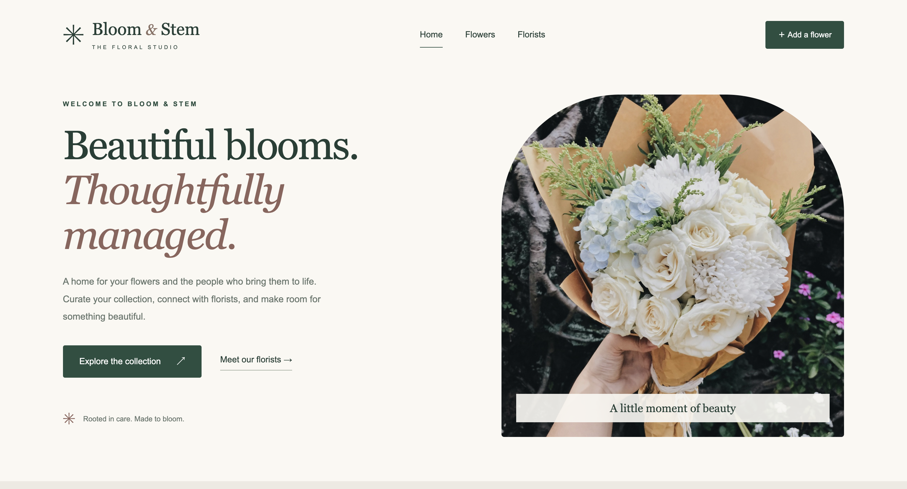
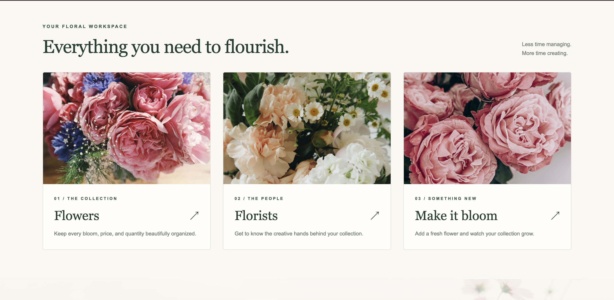
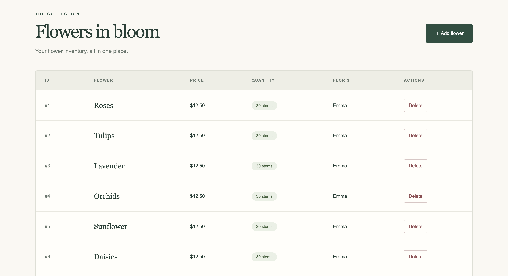
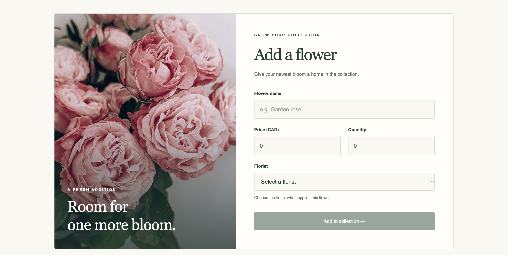
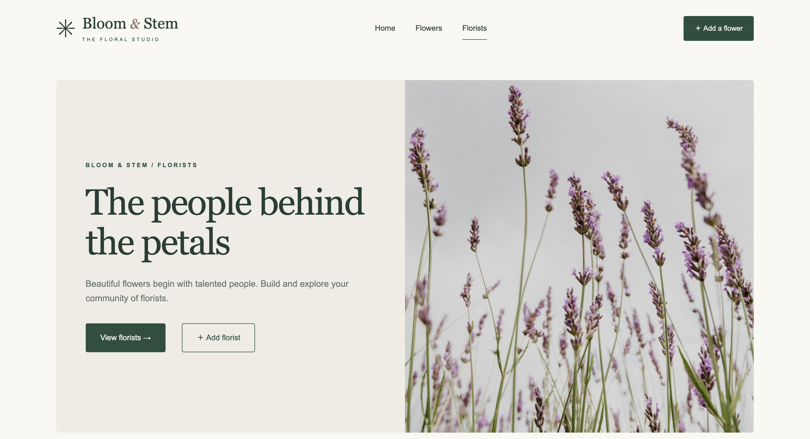
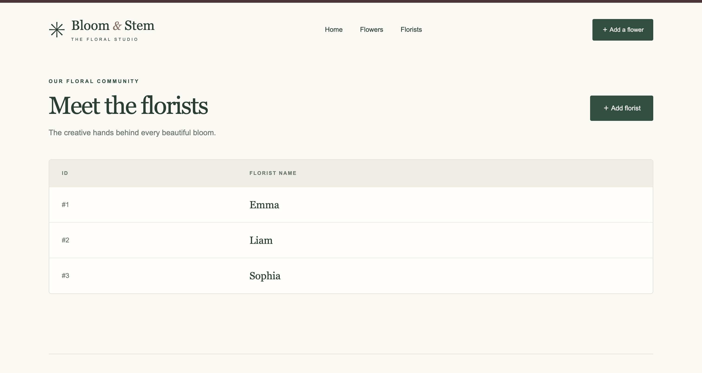
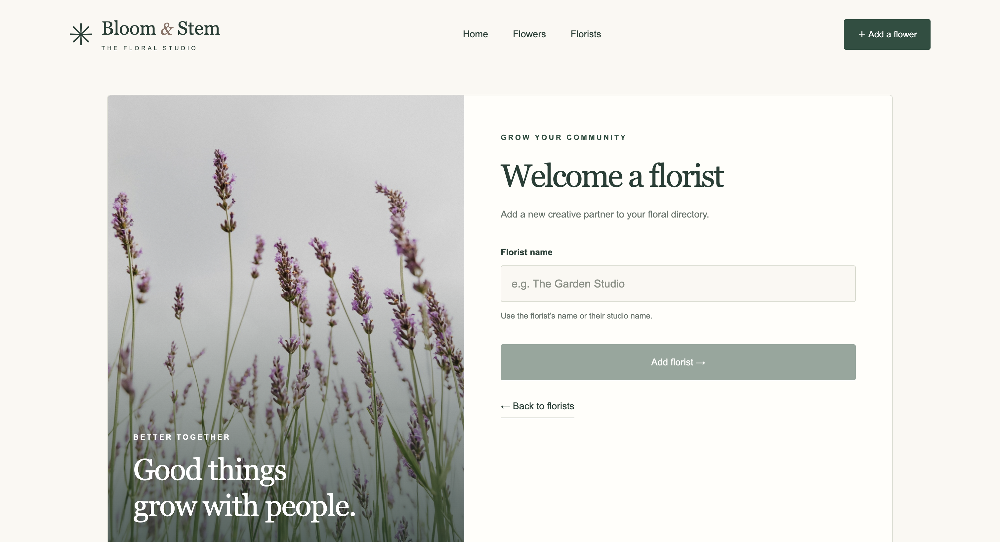

# Bloom & Stem — Flower Shop Management

A full-stack coursework project by Shrusti Shah for managing flowers and florists. The Angular interface communicates with a Spring Boot REST API backed by an in-memory H2 database.

## App screenshots

### Homepage

A floral landing page with shared navigation and quick access to the collection.



### Floral workspace

Quick links for browsing flowers, finding florists, and adding a bloom.



### Flower collection


Track flower prices in CAD, quantities, and the supplying florist.



Add flowers through a labeled form with price, quantity, and florist selection.



### Florist community



Browse the florist directory and welcome new creative partners.





### Finishing details

A floral call to action and a footer crediting the project creator.


## Features

- View and add florists.
- View, add, and delete flowers.
- Track flower names, prices, quantities, and florist names.
- Explore sample data loaded automatically at backend startup.

## Interface

A responsive floral studio design with ivory, blush, and forest-green colors, shared navigation, accessible labeled forms, CAD price formatting, and inventory empty states. All six supplied photographs are optimized and served locally; the interface does not require a CSS CDN.

Photographs: Tomoko Uji (meadow), Jessie Daniella (bouquet), Brigitte Tohm (peonies), Rebecca (garden), Rikonavt (roses), and Sarah Janes (lavender), via Unsplash. Original filenames are documented in `src/main/webapp/public/images/README.md`. These are decorative editorial photographs rather than images of individual inventory records.

## Stack

Java 21, Spring Boot 4.0.4, Spring Data JPA, H2, Lombok, Angular 21, TypeScript, and Maven.

## Run locally

Install Java 21 and a Node.js version supported by Angular 21 (Node 24 works). The Maven wrapper is included.

From the project root, start the backend:

```bash
./mvnw spring-boot:run
```

In a second terminal, start the frontend:

```bash
cd src/main/webapp
npm ci
npm start
```

Open http://localhost:4200. Keep both terminals running; stop each with Ctrl+C. The Angular development proxy forwards API requests to http://localhost:8080.

On Windows, use `mvnw.cmd spring-boot:run` for the backend.

In Eclipse, you can also run `Assignment2ShrustiShahApplication.java` as a Java Application (or Spring Boot App if Spring Tools is installed), then start the frontend in a terminal as above.

The H2 database is in memory: changes reset when the backend restarts. The H2 console is available at http://localhost:8080/h2-console with JDBC URL `jdbc:h2:mem:testdb`, username `sa`, and an empty password.

## REST API

| Method | Endpoint | Purpose |
| --- | --- | --- |
| GET | `/api/v1/florists` | List florists |
| GET | `/api/v1/florists/{id}` | Get a florist |
| POST | `/api/v1/florists` | Add a florist |
| GET | `/api/v1/flowers` | List flowers |
| GET | `/api/v1/flowers/{id}` | Get a flower |
| POST | `/api/v1/flowers` | Add a flower |
| DELETE | `/api/v1/flowers/{id}` | Delete a flower |

Example flower JSON:

```json
{
  "name": "Roses",
  "price": 12.5,
  "quantity": 30,
  "floristName": "Emma"
}
```

## Build and test

```bash
./mvnw test
cd src/main/webapp
npm run build
```

## Project structure

- `src/main/java`: REST controllers, services, repositories, entities, and sample data.
- `src/main/resources`: Spring Boot and database configuration.
- `src/main/webapp`: Angular frontend, including its npm lockfile and development proxy.
- `src/test/java`: backend tests.

GitHub hosts the source code. Running the full application requires both the Angular frontend and Java backend; GitHub Pages alone cannot run this backend.
